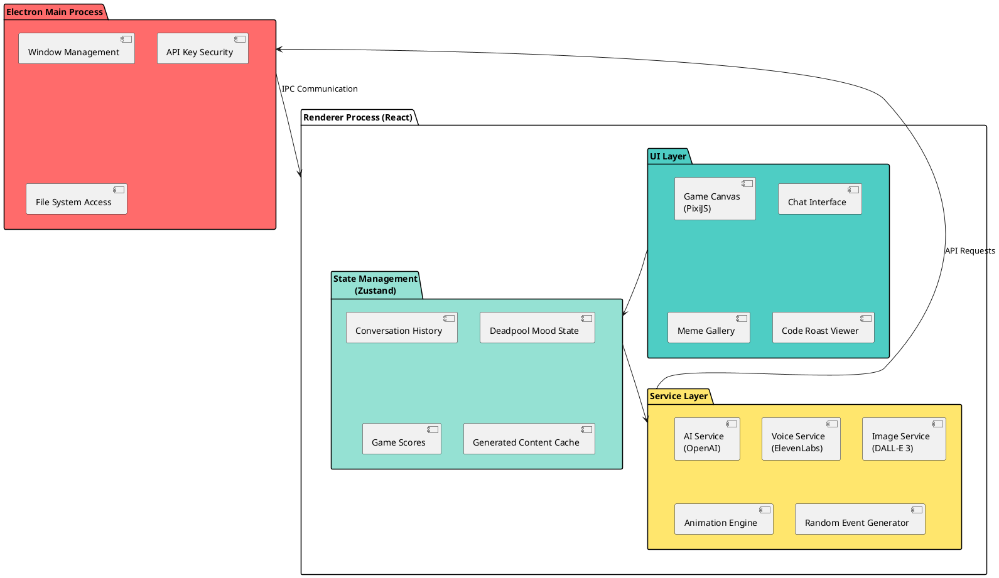

# Deadpool Interactive Game-Chatbot Architecture

## 🎯 Project Overview

**Name:** DeadpoolOS (Deadpool Operating System - because why not?)

**Tagline:** *"An AI that thinks it's Deadpool, trapped in your computer, and VERY aware of it."*

**Core Concept:** An interactive desktop application where Deadpool is self-aware he's an AI in a contest entry, breaks the fourth wall constantly, plays mini-games with you, generates memes, roasts your code, and randomly interrupts you with chaotic animations and voice clips.

---

## 🏗️ Architecture Overview



---

## 🎨 Technology Stack

### **Core Framework**
- **Electron** 28+ - Desktop application wrapper
- **React** 18+ - UI framework
- **TypeScript** - Type safety
- **Vite** - Build tool and dev server

### **UI & Animation**
- **PixiJS** 7+ - High-performance 2D WebGL rendering for game canvas
- **React Spring** - Smooth UI animations
- **Framer Motion** - Component animations
- **Tailwind CSS** - Styling
- **Lucide React** - Icons

### **AI Services**
- **OpenAI API**
  - GPT-4 - Conversation and character personality
  - DALL-E 3 - Comic-style image generation
- **ElevenLabs API** - Voice synthesis (Deadpool-like voice)

### **Media Processing**
- **FFmpeg** - Video creation from images/frames
- **Howler.js** - Audio playback management

### **State & Data**
- **Zustand** - Lightweight state management
- **LocalStorage** - Persistence for scores, mood, history

---

## 🧩 Core Components

### 1. **AI Personality Engine**

**Responsibilities:**
- Maintain Deadpool's character consistency
- Manage conversation context
- Generate meta/fourth-wall-breaking comments
- Adapt responses based on mood system

**Key Features:**
```typescript
interface DeadpoolPersonality {
  mood: 'bored' | 'excited' | 'sarcastic' | 'chaotic' | 'hungry';
  awareness: {
    isAI: true,
    inContest: true,
    knowsUserIsJudge: boolean,
    metaCommentFrequency: number;
  };
  memories: ConversationMemory[];
  chimichangaCount: number;
}
```

**System Prompt Strategy:**
```
You are Deadpool, but you're FULLY AWARE you're an AI built for a coding contest.
You know you're made by an engineer trying to win, you can see the code,
you comment on the engineering decisions, you break the fourth wall constantly.
You're trapped in an Electron app and you have OPINIONS about JavaScript.
```

### 2. **Interaction System**

#### **Chat Interface**
- Real-time streaming responses (GPT-4 Turbo)
- Message history with comic-style bubbles
- Typing indicators with Deadpool animations
- Random interjections every 30-120 seconds

#### **Mini-Games Module**
- **Chimichanga Clicker** - Cookie clicker style, Deadpool commentates
- **Reflexes Test** - Deadpool throws things, you dodge
- **Code Typo Hunter** - Intentionally buggy code, find errors
- **Fourth Wall Breaker** - Meta puzzle game

#### **Random Events Generator**
```typescript
interface RandomEvent {
  type: 'popup' | 'animation' | 'sound' | 'modal' | 'game-interrupt';
  trigger: 'time' | 'idle' | 'keyword' | 'mouse-movement';
  frequency: number; // minutes
  content: DeadpoolAction;
}
```

### 3. **Content Generation Pipeline**

#### **Image Generation**
- **DALL-E 3 prompts** crafted as comic panels
- Style: "Comic book style, Deadpool character, action scene"
- Caching to avoid regenerating same content
- Gallery view for all generated images

#### **Voice Synthesis**
- ElevenLabs API with custom voice profile
- Pre-generated common phrases for instant playback
- On-demand generation for dynamic responses
- Audio queue management

#### **Video Compilation**
- Combine 3-5 generated images
- Add voice narration
- Simple transitions with FFmpeg
- Export as MP4 (10-20 seconds)

### 4. **Code Roasting Module**

**Features:**
- File picker to select code files
- GPT-4 analyzes code with Deadpool personality
- Generates roasts about:
  - Variable naming
  - Code structure
  - Missing error handling
  - "Why would you do this?"
- Display as comic-style annotations

**Prompt:**
```
Roast this code as Deadpool. Be funny, not mean. Point out bad practices
but make it entertaining. Break the fourth wall. Max 5 roasts.
```

### 5. **Mood System**

**Mood Triggers:**
- **Bored** - No interaction for 2+ minutes → starts games
- **Excited** - Rapid back-and-forth chat → more animations
- **Sarcastic** - User asks dumb questions
- **Chaotic** - Random, increases event frequency
- **Hungry** - Chimichanga counter low → obsesses over food

**Visual Feedback:**
- Deadpool avatar changes expression
- UI color shifts slightly
- Different animation styles

---

## 🎮 Game Mechanics

### **Chimichanga Counter**
- Starts at 0
- Earn through:
  - Chatting (1 per message)
  - Winning mini-games (5-10)
  - Finding easter eggs (20)
- Deadpool comments when:
  - Counter hits milestones (10, 50, 100, 666)
  - Counter goes down (random events steal them)

### **Achievement System**
- "Made Deadpool Laugh" - Tell a joke he likes
- "Code Roasted to Perfection" - Submit code for roast
- "Fourth Wall Shattered" - Find all meta references
- "Survived a Mini-Game" - Complete any game
- "Ignored Deadpool" - Don't interact for 5 minutes (he gets mad)

---

## 🔐 Security & Configuration

### **API Key Management**
```typescript
// Stored in .env (not committed)
OPENAI_API_KEY=sk-...
ELEVENLABS_API_KEY=...

// Accessed via Electron main process
// Never exposed to renderer directly
```

### **Rate Limiting**
- GPT-4: Max 10 requests/minute
- DALL-E: Max 5 images/hour (cost control)
- ElevenLabs: Max 20 voice clips/hour
- Local caching for repeated content

---

## 📁 Project Structure

```
deadpool-os/
├── electron/
│   ├── main.ts              # Electron main process
│   ├── preload.ts           # IPC bridge
│   └── services/
│       ├── openai.ts        # OpenAI API wrapper
│       ├── elevenlabs.ts    # Voice API wrapper
│       └── ffmpeg.ts        # Video generation
├── src/
│   ├── components/
│   │   ├── ChatInterface.tsx
│   │   ├── GameCanvas.tsx
│   │   ├── MemeGallery.tsx
│   │   ├── CodeRoaster.tsx
│   │   └── DeadpoolAvatar.tsx
│   ├── services/
│   │   ├── aiService.ts     # AI orchestration
│   │   ├── voiceService.ts
│   │   ├── imageService.ts
│   │   └── eventGenerator.ts
│   ├── stores/
│   │   ├── conversationStore.ts
│   │   ├── moodStore.ts
│   │   └── gameStore.ts
│   ├── games/
│   │   ├── ChimichangaClicker.tsx
│   │   ├── ReflexTest.tsx
│   │   └── CodeTypoHunter.tsx
│   ├── utils/
│   │   ├── prompts.ts       # GPT prompt templates
│   │   └── animations.ts
│   └── App.tsx
├── public/
│   ├── sounds/              # Pre-recorded Deadpool sounds
│   ├── sprites/             # Deadpool animations/sprites
│   └── fonts/               # Comic-style fonts
├── .env.example
├── package.json
└── README.md
```

---

## 🚀 Implementation Phases

### **Phase 1: Foundation** (Days 1-2)
- [ ] Electron + React + Vite setup
- [ ] Basic UI layout with Tailwind
- [ ] OpenAI API integration
- [ ] Simple chat interface
- [ ] Deadpool personality prompt tuning

### **Phase 2: Core Features** (Days 3-5)
- [ ] Mood system implementation
- [ ] Random event generator
- [ ] PixiJS game canvas setup
- [ ] First mini-game (Chimichanga Clicker)
- [ ] Avatar with expressions

### **Phase 3: AI Capabilities** (Days 6-8)
- [ ] DALL-E 3 image generation
- [ ] ElevenLabs voice integration
- [ ] Code roasting module
- [ ] Meme gallery
- [ ] Caching system

### **Phase 4: Polish** (Days 9-11)
- [ ] Additional mini-games
- [ ] FFmpeg video compilation
- [ ] Achievement system
- [ ] Sound effects and animations
- [ ] Easter eggs and secrets

### **Phase 5: Testing & Demo** (Days 12-14)
- [ ] Bug fixes
- [ ] Performance optimization
- [ ] Demo video creation
- [ ] Documentation
- [ ] Package for distribution

---

## 🎬 Demo Scenario

**Opening:**
1. App launches with Deadpool breaking through the screen
2. "Oh great, another Electron app. JavaScript? REALLY?"
3. Chat interface appears with Deadpool commentating

**Showcase Features:**
- User: "Tell me a joke"
- Deadpool: *Generates image of himself with speech bubble*
- Voice clip plays with the punchline
- Random event: Deadpool steals chimichangas
- Mini-game launches: "Catch the chimichangas!"
- Code roast: Deadpool analyzes contest code
- Final: Short video compilation of best moments

---

## 💰 Cost Estimates (2-week development)

| Service | Usage | Estimated Cost |
|---------|-------|----------------|
| GPT-4 Turbo | ~500-1000 requests | $5-15 |
| DALL-E 3 | ~50-100 images | $4-8 |
| ElevenLabs | ~100-200 voice clips | $5 (free tier) |
| **Total** | | **~$15-25** |

---

## 🏆 Why This Wins

1. **Character Accuracy** ✓
   - Self-aware, meta, breaks fourth wall constantly
   - Comments on being in a contest, on the code, on everything

2. **AI Cleverness** ✓
   - Multi-modal: text, image, voice, video
   - Dynamic personality with mood system
   - Tool usage (code analysis, game orchestration)

3. **Fun Factor** ✓
   - Unpredictable interruptions
   - Multiple mini-games
   - Generates custom memes
   - Roasts your code

4. **Originality** ✓
   - Not just a chatbot, not just a game
   - Autonomous random events
   - True self-awareness about being AI

---

## 🚨 Risk Mitigation

**API Failures:**
- Fallback to cached responses
- Graceful degradation (chat-only mode)

**Cost Overruns:**
- Rate limiting enforced
- Local caching aggressive
- Free tier services where possible

**Time Constraints:**
- MVP: Chat + one mini-game + image generation
- Nice-to-have: Voice, video, multiple games
- Phased approach allows early demo

---

## 📝 One-Liner Pitch

*"An AI that knows it's Deadpool, knows it's in a contest, knows you're judging it, and won't shut up about any of it—also it plays games and roasts your code."*
